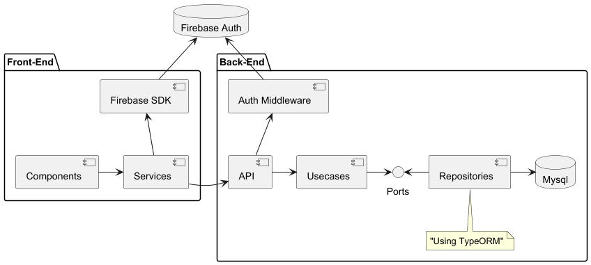

# Architecture

You can have a look at the [Architecture decision records](./decisions/decisions.md) for more info, but the following architecture is currently used in the app:
* Angular Front, using FirebaseSDK for authentication
* NestJs Back:
  * REST API with heavy HATEOAS investment
  * authenticating through Firebase JWT
  * with a Mysql database hidden behind Typeorm (thus easy to swap)
  * with a modular monolith architecture, some modules being simple, other following hexagonal
  * Server-Sent Events (SSE) for back -> front communication
  * Event Driven Architecture (through EventEmitter) for cross module, asynchronous communication
